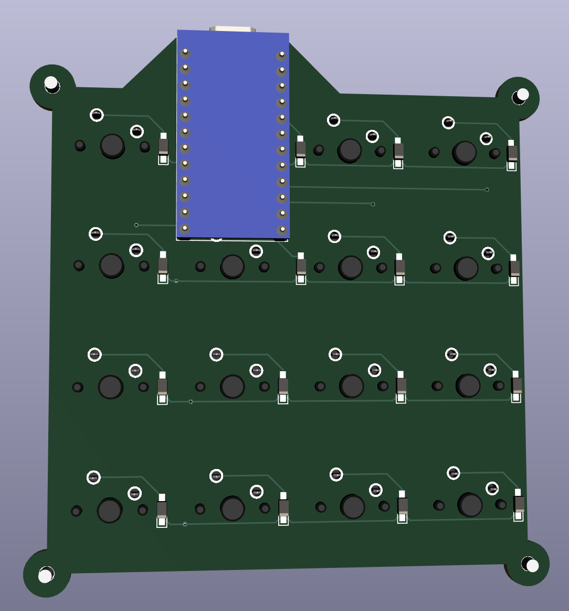

# wym16 Keyboard


パーツの組み付け順を変えることで、１台で５種類のケース構成方法（プレートの固定方式）を試せるお得なキーパッドです。

組み立てた後でも、５種類のうち４種類の固定方法については、ハンダを剥がすことなく行き来することができます。

ケースの構成方法は高級志向になりつつある自作/カスタムキーボードで重要になってくるトピックの一つだと思いますが、スイッチなどと違って「とりあえずいろんな種類を買ってみて比較する」というのもなかなか難しいので設計してみました。

ケースの形状、キーのレイアウト、ケース全体の質量などほぼすべての条件が同一の状態で色々な固定方式を試せるため、方式ごとの純粋な特徴を観察することができると期待しています。打面の高さもどの方式で組んでもぴったり同じになるようにしてあります。

自分のお気に入りのケースのタイプを見つける参考になればいいなと思います。

## 作れる構成

※「サンドイッチマウント」のみ、別の方式ですでに半田付けが済んでいる場合は、いったんそれを剥がさないと構成することができません。

※「ケースマウント」以外は、キーを入力できる必要がない場合、基板なしで、半田付けをせずに構成することもできます (→ サンドイッチマウントとの行き来が容易)。

※それ以外の方式については、一度組み立ててしまった後でもネジを外してプレートを入れ替えるだけで自由に組み替えることができます。

- ケースマウント


基板をケースに固定し、スイッチプレートは浮かせておく方式です。

- ボトムマウント


ケースの下側にプレートを固定し、基板は吊り下げておく方式です。

- トップマウント


ケースの上側にプレートを固定し、基板は吊り下げておく方式です。

- ガスケットマウント


ゴムなど柔らかめの素材で上下から挟み込むことでプレートをやさしく固定し、基板は吊り下げておく方式です。

- サンドイッチマウント


ケースの上側と下側でがっちり挟み込んでプレートをケースと一体化させ、基板は吊り下げておく方式です。

## 必要なパーツ

- キット
  - プレート (10 種 12 枚)
  - 基板
  - (おまけ リーフスプリング風？トッププレート x1)

- 電子部品
  - MX 互換スイッチ x16
  - ダイオード 1N4148w x16
  - Pro Micro

- ケース部品
  - M2 ネジ 6mm x 4, 21mm x 9
    - キャスト材の場合は 20mm でもいいかも
  - M2 三種ナット x21
    - 三種＝少し薄手の (1.2mm) ナット
    - 13 個はネジを止めるために使用、8 個はスペーサとして使用
  - 2mm 厚ゴム板 (ガスケットとして使用)
  - ゴム足 x4

## 組立て
### プレートの命名

プレートの形状が 10 種類 (おまけ込み 11 種類) もあってヤバいので、それぞれにわかりやすい名前をつけることにします。

#### ボトムプレート


一種類しかないので一番わかりやすいです。いつでも底板として使用します。

#### トッププレート


スイッチの穴がたくさん空いているプレートがトッププレートです。

大きい方はサンドイッチマウント専用で、それ以外の方式ではすべて小さい方を使います。

おまけで小さい方のプレートに切れ込みを入れたものも作ってみました。

ネジ穴周辺の強度をあえて落とすことでしなりを均一にする効果を期待しています (リーフマウント方式ということもあるみたいです) が、アクリルでどれくらいちゃんと機能するかは未知数です。

#### トップフレーム


残りの外枠フレームたちのうち、 *MicroUSB の差し込み口が開いていない* ものを「トップフレーム」と呼ぶことにします。

これらはすべてトッププレートより上側に使用します。

- 普通のトップフレーム

一番穴の少ないシンプルな形のものです。 3mm と 2mm の２種類の厚みがあります。

**3mm のものはいつも一番上に使用する化粧板です**。

- ネジ穴付きトップフレーム

穴が４つ多く開いているトップフレームです。

「トップマウント」時にトッププレートを固定するために使用します。

- タブ穴付きトップフレーム

小さい方のトッププレートが収まりそうな、変な形の穴があいたトップフレームです。

3mm と 2mm の２種類の厚みがあり、 3mm の方には四隅に小さな出っ張りのようなものがついています。

**3mm のものはいつも小さい方のトッププレートを囲うように使用します** (ちょうどトッププレートも 3mm です)。

#### ミドルフレーム


残りの外枠フレームたちには、 *MicroUSB の差し込み口が開いてい* ます。これらを「ミドルフレーム」と呼ぶことにします。

これらはすべてトッププレートより下側に使用します。

- 普通のミドルフレーム

一番穴の少ないシンプルな形のものです。 3mm と 2mm の２種類の厚みがあります。

**3mm のものはどの構成でもボトムプレートのすぐ上に載ります**。

- ネジ穴付きミドルフレーム

穴が４つ多く開いているミドルフレームです。

「ボトムマウント」時にトッププレートを固定するために使用します。

- タブ穴付きミドルフレーム

一番複雑な形状をしたフレームです。

多くの方式でトッププレートの下に使用します。

### 基板を実装する



キー入力をできるようにしたい場合、あるいはケースマウントを試したい場合、ハンダ付けが必須です。

1. 基板にダイオードをハンダ付け

基板のコの字の印がダイオードのカソード（線が引いてある）側になるように取り付けます。

2. ProMicro にコンスルーをハンダ付け

ProMicro にコンスルーをハンダ付けします。部品面が内側になるようにします。

向きなどはこちらも参考にしてください https://yushakobo.zendesk.com/hc/ja/articles/360044233974-%E3%82%B3%E3%83%B3%E3%82%B9%E3%83%AB%E3%83%BC-%E3%82%B9%E3%83%97%E3%83%AA%E3%83%B3%E3%82%B0%E3%83%94%E3%83%B3%E3%83%98%E3%83%83%E3%83%80-%E3%81%AE%E5%8F%96%E3%82%8A%E4%BB%98%E3%81%91%E6%96%B9%E3%82%92%E6%95%99%E3%81%88%E3%81%A6%E4%B8%8B%E3%81%95%E3%81%84

3. ProMicro にファームウェアを書き込み

https://github.com/zk-phi/qmk_firmware にファームウェアをアップロードしておきます。

```
make handwired/wym16:default:avrdude
```

リセットを要求されたら電気を通すピンセットなどで RST ピンと GND ピンをショートしてください。

4. ProMicro を差し込み動作確認

ProMicro を基板に差し込みます。ハンダ付けは不要です。

スイッチが入るピンをピンセットなどでショートし、キー入力が行われることを確認します。

うまくいかない場合、コンスルーまたはダイオードのハンダ不良の可能性があります。

5. スイッチをトッププレートにはめる

サンドイッチマウントを試す場合は大きなプレートを、それ以外の場合は小さなプレートを使用してください。

6. スイッチをトッププレートごと基板に押し付ける

トッププレートが基板から 2mm 浮いた状態になりますが、合っています。スイッチはぴったり基板に押し付けるようにしてください。

7. 基板にスイッチをハンダ付け

ProMicro を一旦外し、スイッチをハンダづけします。

ProMicro の真裏にくるスイッチについては足をカットし、ハンダもあまり盛りすぎないようにしておくのが安全です (ProMicro の個体によっては干渉します)。

ハンダ付けが終わったら ProMicro をまた差し込んで完成です。

### ケースマウント


1. ボトムプレートにミドルフレーム 3mm/2mm を重ね、その上にタブ穴付きミドルフレームを載せる

トッププレートが下にたわむ余地を残したいので、タブ穴付きを一番上にします。

2. 基板の４つの足にナットを 2 つづつ履かせて、ボトムプレートにネジで取り付ける

ナットが１個 1.2mm なので、２個重ねることで基板がボトムプレートから 2.4mm 浮いた状態になります。

これによって他のマウント方法と打面の高さをぴったり揃え、同じ条件で比較することができるようになります。

3. タブ穴付きトップフレーム 3mm, 2mm、トップフレーム 2mm, 3mm をこの順に載せて、全体をネジで締めて完成

### ボトムマウント


1. トッププレートの下にネジ穴付きミドルフレームを敷き、ネジで固定する

2. ボトムプレートにミドルフレーム 3mm、タブ穴付きミドルフレームをこの順に重ね、上に 1. を載せる

3. タブ穴付きトップフレーム 3mm, 2mm、トップフレーム 2mm, 3mm をこの順に載せて、全体をネジで締めて完成

### トップマウント


1. トッププレートの上にネジ穴付きトップフレームを載せ、ネジで固定する

2. ボトムプレートにミドルフレーム 3mm, 2mm、タブ穴付きミドルフレーム、タブ穴付きトップフレーム 3mm をこの順に重ね、上に 1. を載せる

3. タブ穴付きトップフレーム 2mm, トップフレーム 3mm をこの順に重ねて、全体をネジで締めて完成

### ガスケットマウント


1. ボトムプレートの上にミドルフレーム 3mm, 2mm、タブ付きミドルフレームをこの順に重ねる

3. 2mm 厚のゴム板をカットして、４つのタブ穴に仕込む

4. 基板＆トッププレートを載せる

5. タブ付きトップフレーム 3mm, 2mm をこの順に重ねる

6. 2mm 厚のゴム板をカットして、４つのタブ穴に仕込む

7. トップフレーム 2mm, 3mm を載せて、全体をネジで締めて完成

### サンドイッチマウント


1. ボトムプレートの上にミドルフレーム 3mm, 2mm、タブ付きミドルフレームをこの順に重ねる

2. 基板＆大きなトッププレートを載せる

3. タブ付きトップフレーム 2mm、 トップフレーム 2mm, 3mm をこの順に重ねて、全体をネジで締めて完成
